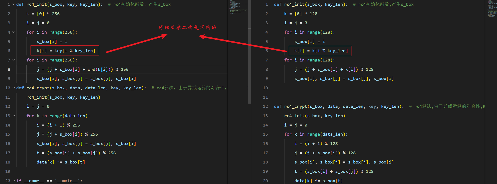

> 文章转载自[CTF-reverse逆向分析解题常用脚本汇总_ctf reverse-CSDN博客](https://blog.csdn.net/liKeQing1027520/article/details/138533062?spm=1001.2014.3001.5502)

>  注：本篇用于记录一些CTF-reverse中可能用上的脚本，脚本都来源于博主解出某道题后留下，如果遇上类似的题目，根据**脚本中****注释**的提示更改对应的**密文密钥或条件**即可快速解题！ 
 持续更新！！**点个收藏关注不迷路~** 


## 一，AES解密

原文链接->[AES加密解密算法_aes解密-CSDN博客](https://blog.csdn.net/liKeQing1027520/article/details/137024097)


>  你需要： 
>  ①在题目中找到密钥，赋值给脚本中的key变量 
>  ②找到密文，赋值给脚本中的cipher变量 
>  ③运行即可获得明文 


```
from Crypto.Cipher import AES
 
def AES_dec(cipher, key):
    key = key.encode()
    cipher = bytes.fromhex(cipher)
    aes = AES.new(key, AES.MODE_ECB) #创建一个AES解密对象，需要传入密钥和加密模式（这里是ECB模式）
    return aes.decrypt(cipher).decode() #返回解密结果

if __name__ == '__main__':
    key = '1234567890123456' 
    #注意解密过程中密文的格式需要为byte类型，本题获取到的是十六进制文本，处理成字符串后使用bytes.fromhex()函数转为对应的字节数组
    cipher = 'F3498AED82CE44E2357C23F5DCF897A43B6A7BFEE0467C591E301CBC38F99913'
    res = AES_dec(cipher, key)
    print(res)
```


##  二，z3求解器（求解约束方程未知数）

原文链接->[z3求解器脚本（CTF-reverse必备）-CSDN博客](https://blog.csdn.net/liKeQing1027520/article/details/138047537)

>
>  你需要： 
>  ①使用第一个脚本可以将题目中的一大串条件转换成列表，以便直接套用第二个脚本，具体看本篇-> [批量替换字符串中的某子串序列为对应的另一子串序列（z3求解器解多元方程时很好用）-CSDN博客](https://blog.csdn.net/liKeQing1027520/article/details/141174137?spm=1001.2014.3001.5502)
>  ②将脚本1处理得到的列表赋值给脚本2的fc列表 
>  ②运行后即可获得解（该脚本自动将解按v[0]~v[n]的升序[CTF-reverse-simpleRE（base64变表逆向）-CSDN博客](https://blog.csdn.net/liKeQing1027520/article/details/137441614)排列并转换成了对应的ASCII码，如果题目有格外加密，自行修改脚本即可） 


```
import re

def replace_func(match):
    shift = 2 #shift是指第一个未知数和0的差，例如：如果题目中第一个未知数是v2（如果是v3），那么shift就设置成2（就设置成3）
    index = int(match.group(1)) - shift
    return str(f'v[{index}]')  # 返回字符串'v[a后数字-1]'，用其替换匹配到的an


if __name__ == '__main__':
    s1 = "245 * v6 + 395 * v5 + 3541 * v4 + 2051 * v3 + 3201 * v2 + 1345 * v7 != 855009| | 3270 * v6 + 3759 * v5 + 3900 * v4 + 3963 * v3 + 1546 * v2 + 3082 * v7 != 1515490| | 526 * v6 + 2283 * v5 + 3349 * v4 + 2458 * v3 + 2012 * v2 + 268 * v7 != 854822| | 3208 * v6 + 2021 * v5 + 3146 * v4 + 1571 * v3 + 2569 * v2 + 1395 * v7 != 1094422| | 3136 * v6 + 3553 * v5 + 2997 * v4 + 1824 * v3 + 1575 * v2 + 1599 * v7 != 1136398| | 2300 * v6 + 1349 * v5 + 86 * v4 + 3672 * v3 + 2908 * v2 + 1681 * v7 != 939991| | 212 * v22 + 153 * v21 + 342 * v20 + 490 * v12 + 325 * v11 + 485 * v10 + 56 * v9 + 202 * v8 + 191 * v23 != 245940| | 348 * v22 + 185 * v21 + 134 * v20 + 153 * v12 + 460 * v9 + 207 * v8 + 22 * v10 + 24 * v11 + 22 * v23 != 146392| | 177 * v22 + 231 * v21 + 489 * v20 + 339 * v12 + 433 * v11 + 311 * v10 + 164 * v9 + 154 * v8 + 100 * v23 != 239438| | 68 * v20 + 466 * v12 + 470 * v11 + 22 * v10 + 270 * v9 + 360 * v8 + 337 * v21 + 257 * v22 + 82 * v23 != 233887| | 246 * v22 + 235 * v21 + 468 * v20 + 91 * v12 + 151 * v11 + 197 * v8 + 92 * v9 + 73 * v10 + 54 * v23 != 152663| | 241 * v22 + 377 * v21 + 131 * v20 + 243 * v12 + 233 * v11 + 55 * v10 + 376 * v9 + 242 * v8 + 343 * v23 != 228375| | 356 * v22 + 200 * v21 + 136 * v11 + 301 * v10 + 284 * v9 + 364 * v8 + 458 * v12 + 5 * v20 + 61 * v23 != 211183| | 154 * v22 + 55 * v21 + 406 * v20 + 107 * v12 + 80 * v10 + 66 * v8 + 71 * v9 + 17 * v11 + 71 * v23 != 96788| | 335 * v22 + 201 * v21 + 197 * v11 + 280 * v10 + 409 * v9 + 56 * v8 + 494 * v12 + 63 * v20 + 99 * v23 != 204625| | 428 * v18 + 1266 * v17 + 1326 * v16 + 1967 * v15 + 3001 * v14 + 81 * v13 + 2439 * v19 != 1109296| | 2585 * v18 + 4027 * v17 + 141 * v16 + 2539 * v15 + 3073 * v14 + 164 * v13 + 1556 * v19 != 1368547| | 2080 * v18 + 358 * v17 + 1317 * v16 + 1341 * v15 + 3681 * v14 + 2197 * v13 + 1205 * v19 != 1320274| | 840 * v18 + 1494 * v17 + 2353 * v16 + 235 * v15 + 3843 * v14 + 1496 * v13 + 1302 * v19 != 1206735| | 101 * v18 + 2025 * v17 + 2842 * v16 + 1559 * v15 + 2143 * v14 + 3008 * v13 + 981 * v19 != 1306983| | 1290 * v18 + 3822 * v17 + 1733 * v16 + 292 * v15 + 816 * v14 + 1017 * v13 + 3199 * v19 != 1160573"  # 定义包含an的字符串
    s1 += '| | 186 * v18 + 2712 * v17 + 2136 * v16 + 98 * v13 + 138 * v14 + 3584 * v15 + 1173 * v19 == 1005746'

    s1 = re.sub(r'v(2[0-9]|1[0-9]|[1-9])', replace_func, s1)
    # sub函数参数, pattern、repl、string分别表示：正则表达式匹配规则、替换后结果（可以是函数也可以是常量）、要被查找替换的原始字符串
    s1 = re.sub('!', '=', s1) #有些题目给的条件的方程是用'||'关系运算符连接的不等式方程，需要用这一行代码将'!'替换成'='变成等式方程
    res = s1.split('| | ')
    print(res)

```

```
from z3 import *

def solver_eng(fc):
    # 创建解释器对象
    solver = Solver()
    # 添加约束方程
    for i in range(len(fc)):
        solver.add(eval(fc[i])) #eval函数会将字符串形式的方程转换为z3模块能解析的方程

    # 求解并转化为字符输出，得到flag
    if solver.check() == sat:  # check()方法用来判断是否有解，sat(即satisify)表示满足有解
        ans = solver.model()  # model()方法得到解
        for i in v:
            print(chr(ans[i].as_long()), end='')
    # 一般不会无解，如果无解八成是未知数变量的类型不符合，或约束方程添加错误
    else:
        print("no ans!")


if __name__ == '__main__':
    # 设置方程，请用脚本1将条件中的所有方程处理成列表，然后赋值给fc列表（这样你就不用一个一个方程慢慢去复制了）
    fc = ['245 * v[4] + 395 * v[3] + 3541 * v[2] + 2051 * v[1] + 3201 * v[0] + 1345 * v[5] == 855009', '3270 * v[4] + 3759 * v[3] + 3900 * v[2] + 3963 * v[1] + 1546 * v[0] + 3082 * v[5] == 1515490', '526 * v[4] + 2283 * v[3] + 3349 * v[2] + 2458 * v[1] + 2012 * v[0] + 268 * v[5] == 854822', '3208 * v[4] + 2021 * v[3] + 3146 * v[2] + 1571 * v[1] + 2569 * v[0] + 1395 * v[5] == 1094422', '3136 * v[4] + 3553 * v[3] + 2997 * v[2] + 1824 * v[1] + 1575 * v[0] + 1599 * v[5] == 1136398', '2300 * v[4] + 1349 * v[3] + 86 * v[2] + 3672 * v[1] + 2908 * v[0] + 1681 * v[5] == 939991', '212 * v[20] + 153 * v[19] + 342 * v[18] + 490 * v[10] + 325 * v[9] + 485 * v[8] + 56 * v[7] + 202 * v[6] + 191 * v[21] == 245940', '348 * v[20] + 185 * v[19] + 134 * v[18] + 153 * v[10] + 460 * v[7] + 207 * v[6] + 22 * v[8] + 24 * v[9] + 22 * v[21] == 146392', '177 * v[20] + 231 * v[19] + 489 * v[18] + 339 * v[10] + 433 * v[9] + 311 * v[8] + 164 * v[7] + 154 * v[6] + 100 * v[21] == 239438', '68 * v[18] + 466 * v[10] + 470 * v[9] + 22 * v[8] + 270 * v[7] + 360 * v[6] + 337 * v[19] + 257 * v[20] + 82 * v[21] == 233887', '246 * v[20] + 235 * v[19] + 468 * v[18] + 91 * v[10] + 151 * v[9] + 197 * v[6] + 92 * v[7] + 73 * v[8] + 54 * v[21] == 152663', '241 * v[20] + 377 * v[19] + 131 * v[18] + 243 * v[10] + 233 * v[9] + 55 * v[8] + 376 * v[7] + 242 * v[6] + 343 * v[21] == 228375', '356 * v[20] + 200 * v[19] + 136 * v[9] + 301 * v[8] + 284 * v[7] + 364 * v[6] + 458 * v[10] + 5 * v[18] + 61 * v[21] == 211183', '154 * v[20] + 55 * v[19] + 406 * v[18] + 107 * v[10] + 80 * v[8] + 66 * v[6] + 71 * v[7] + 17 * v[9] + 71 * v[21] == 96788', '335 * v[20] + 201 * v[19] + 197 * v[9] + 280 * v[8] + 409 * v[7] + 56 * v[6] + 494 * v[10] + 63 * v[18] + 99 * v[21] == 204625', '428 * v[16] + 1266 * v[15] + 1326 * v[14] + 1967 * v[13] + 3001 * v[12] + 81 * v[11] + 2439 * v[17] == 1109296', '2585 * v[16] + 4027 * v[15] + 141 * v[14] + 2539 * v[13] + 3073 * v[12] + 164 * v[11] + 1556 * v[17] == 1368547', '2080 * v[16] + 358 * v[15] + 1317 * v[14] + 1341 * v[13] + 3681 * v[12] + 2197 * v[11] + 1205 * v[17] == 1320274', '840 * v[16] + 1494 * v[15] + 2353 * v[14] + 235 * v[13] + 3843 * v[12] + 1496 * v[11] + 1302 * v[17] == 1206735', '101 * v[16] + 2025 * v[15] + 2842 * v[14] + 1559 * v[13] + 2143 * v[12] + 3008 * v[11] + 981 * v[17] == 1306983', '1290 * v[16] + 3822 * v[15] + 1733 * v[14] + 292 * v[13] + 816 * v[12] + 1017 * v[11] + 3199 * v[17] == 1160573', '186 * v[16] + 2712 * v[15] + 2136 * v[14] + 98 * v[11] + 138 * v[12] + 3584 * v[13] + 1173 * v[17] == 1005746']
    # 创建未知数变量
    v = [Int(f'v{i}') for i in range(0, len(fc))]

    solver_eng(fc)
```


## 三，base系列解密

### （一）base64换表解密

原文链接->[CTF-reverse-simpleRE（base64变表逆向）-CSDN博客](https://blog.csdn.net/liKeQing1027520/article/details/137441614)

>  
 你需要： 
 ①在题目中找到换掉的base64表，赋值给s2 
 ②将密文赋值给en_text 
 ③运行后即可获得明文 


```
import base64 #导入base64模块用于解密
s1 = 'ABCDEFGHIJKLMNOPQRSTUVWXYZabcdefghijklmnopqrstuvwxyz0123456789+/' #标准表
s2 = 'qvEJAfHmUYjBac+u8Ph5n9Od17FrICL/X0gVtM4Qk6T2z3wNSsyoebilxWKGZpRD' #base64换表
en_text = '5Mc58bPHLiAx7J8ocJIlaVUxaJvMcoYMaoPMaOfg15c475tscHfM/8==' #密文
 
map = str.maketrans(s2, s1) #用str类中的maketrans建立映射，注意第一个参数是需要映射的字符串，第二个参数是映射的目标
map_text = en_text.translate(map) #映射实现替换密文，替换前是base64换表加密，替换后则是base64标准表加密
print(map_text) #可以先看看标准表加密的原base64密文
print(base64.b64decode(map_text)) #直接使用提供的base64解密函数解密
```


### （二）base58换表解密

>  
 和上面那个基本没啥区别说实话……会用上面那个这个你一定会用 


```
import base58  # 导入base58模块用于解密
s1 = '123456789ABCDEFGHJKLMNPQRSTUVWXYZabcdefghijkmnopqrstuvwxyz'  # 标准表
s2 = 'ABCDEFGHJKLMNPQRSTUVWXYZ123456789abcdefghijkmnopqrstuvwxyz'  # base58换表
en_text = 'BQ3SDnTj7vaKkMvur'  # 密文

# 用str类中的maketrans建立映射，注意第一个参数是需要映射的字符串，第二个参数是映射的目标
map = str.maketrans(s2, s1)
map_text = en_text.translate(map)  # 映射实现替换密文，替换前是base58换表加密，替换后则是base58标准表加密
print(map_text)  # 可以先看看标准表加密的原base58密文
print(base58.b58decode(map_text).decode())  # 直接使用提供的base58解密函数解密
```


### （三）应对base64魔改加密的原始脚本

原文链接->[最简单的编码（Ezbase.zip，base64魔改）-CSDN博客](https://blog.csdn.net/liKeQing1027520/article/details/142416583?spm=1001.2014.3001.5501)

>  
 有些题目会在base64关键加密（即索引查表替换）处进行魔改，此时直接用在线解密网站和python库无法完成解密，需要用相对原始脚本来进行解密，具体看上面链接指向的文章，有例题解释 


```
table = "ABCDEFGHIJKLMNOPQRSTUVWXYZabcdefghijklmnopqrstuvwxyz0123456789+/"  # base64变表
cipher = "YWJjZGVmZw=="  # 密文
cipher = cipher.rstrip('=') #去除密文多余的'='
_index = []
key = [1, 2, 3, 4]
for i in range(len(cipher)):
    tmp = table.index(cipher[i])
    _index.append(tmp)
print(_index)
for i in range(0, len(_index), 4):
    a = _index[i]
    b = _index[i + 1]
    c = _index[i + 2] if i + 2 < len(_index) else 0  # 添加范围检查，为未处理部分设为0
    d = _index[i + 3] if i + 3 < len(_index) else 0
    sum = a < 18 | b < 12 | c < 6 | d
    for j in range(3):
        if i * 6 + j * 8 < len(cipher) * 8:  # 检查是否超出原始编码长度
            print(chr((sum >> ((2 - j) * 8)) &amp; 0xff), end="")
```

## 四，二维四向迷宫路径求解

>  
 （注：请查看原文学习使用两个脚本！这个脚本的使用相对复杂，但好用！！） 


原文链接->[CTF-reverse二维四向迷宫路径求解-CSDN博客](https://blog.csdn.net/liKeQing1027520/article/details/138583198?spm=1001.2014.3001.5501)

>  <h3>（一）脚本一：处理迷宫为二维列表</h3> 
>
>  ```python
>  str为ida中使用快捷键[shift+e]提取到的数据, 如果提取的是string literal则加上引号视作字符串，如果是C array(decimal)则加上中括号视作列表
>  
>  str = "字符串"/[一维列表] 
>  
>  s = 0 #s用作索引访问str, 供下面tmp列表取值
>  
>  #分析题目后设置迷宫的行列
>  row =  #设置二维迷宫行数
>  col =  #设置二维迷宫列数
>  
>  maze = []
>  for i in range(row):
>      tmp = []
>      for j in range(col):
>          tmp.append(str[s])
>          s+=1
>      maze.append(tmp) #凑一行添加一行到迷宫中
>  print(maze)
>  ```
>
>  <h3>（二）脚本二：获得迷宫路径</h3> 
>
>  ```python
>  from collections import deque
>  
>  #设置二维四向迷宫, 如果题目是多个小迷宫问题, 拆分多次调用脚本获取路径即可
>  maze = 二维列表迷宫
>  path_len = 0x7fffffff#如果题目未给出终点坐标，则一定会指定路径的长度，在此处修改路径长度，否则请保留path_len的极大值
>  
>  #进行BFS寻找路径
>  def bfs(start, end, barrier):
>      directions = [(0, 1), (1, 0), (0, -1), (-1, 0)] # 定义四个方向的移动
>      for i in range(len(maze)):#获取起点和终点在列表中的索引
>          for j in range(len(maze[i])):
>              if(maze[i][j] == start):
>                  start = (i, j)
>              if(maze[i][j] == end):
>                  end = (i, j)
>  	#以下均是bfs算法套路
>  	queue = deque()
>  	queue.append((start, [start]))  # (当前位置, 路径)
>  	visited = set()
>  	visited.add(start)
>      while queue:
>          position, path = queue.popleft()
>          if position == end:
>              return path
>          elif len(path)==path_len:
>              return path
>          for d in directions:
>            next_position = (position[0] + d[0], position[1] + d[1])
>            if 0 <= next_position[0] < len(maze) and 0 <= next_position[1] < len(maze[0]) and \ 
>               maze[next_position[0]][next_position[1]] != barrier and next_position not in visited:
>                queue.append((next_position, path + [next_position]))
>                visited.add(next_position)
>      return None
>  
>  #执行BFS搜索并打印结果
>  if __name__ == '__main__':
>      #maze[起点x坐标][起点y坐标] = 'S' #如果题目给了起点终点的坐标，在这里直接给起点和终点添加特征
>      #maze[终点x坐标][终点y坐标] = 'E'
>      
>      path = bfs('S', 'E', 1) #bfs函数传入参数代表起点、终点、障碍的特征(若题目给出的数据无特征, 手动添加特征即可, 通常障碍是1也有可能是0或其它字符如'#')
>      print("移动路径坐标：", path)
>      print("移动路径方位：{", end='')
>      for i in range(1 ,len(path)):
>          x1, y1, x2, y2 = path[i - 1][0], path[i - 1][1], path[i][0], path[i][1]
>          if(x1 > x2):#上
>              print("w", end='')
>          elif(x1 < x2):#下
>              print("s", end='')
>          elif(y1 > y2):#左
>              print("a", end='')
>          elif(y1 < y2):#右
>              print("d", end='')
>      print('}')
>  
>  ```


## 五，凯撒密码移位解密

自己写了个脚本方便快速解决各类凯撒密码rot移位，可以设置大写、小写字母和字符数字是否发生位移

```
def caesarDecode(en_text, rot, rot_upper, rot_lower, rot_diggit):
    tmp=''
    for i in en_text:
        if(i.isupper() and rot_upper): #i是大写字母而且设置了要移大写字母
            tmp += chr((ord(i) - 65 - rot) % 26 + 65)
        elif(i.islower() and rot_lower):
            tmp += chr((ord(i) - 97 - rot) % 26 + 97)
        elif(i.isdigit() and rot_diggit):
            tmp += chr((ord(i) - 48 - rot) % 26 + 48)
        else:
            tmp += i
    return tmp

if __name__=='__main__':
    en_text = "EmBmP5Pmn7QcPU4gLYKv5QcMmB3PWHcP5YkPq3=cT6QckkPckoRG" #设置密文
    rot = 3 #设置位移数, 如果是左移设置成负数即可
    rot_upper = True #移大写字母
    rot_lower = True #移小写字母
    rot_diggit = True #移数字字符
    #一般只会移这三类，如果题目特殊，可以自行添加，在caesarDecode()函数中添加对应的分支判断即可

    en_text = caesarDecode(en_text, rot, rot_upper, rot_lower, rot_diggit)
    print(en_text)
```


## 六，对字符串进行md5加密

题目经常会让对最终输出字符串进行md5加密得到的结果才是flag，使用此脚本即可对字符串进行md5加密

>  
 ①直接将要加密的内容赋值给flag变量 
 ②如果要加密成大写字母形式，使用upper()函数 


```
import hashlib
flag = 'ddsssddddsssdssdddddsssddddsssaassssdddsddssddwddssssssdddssssdddss'
md5 = hashlib.md5() ## 创建md5对象
md5.update(flag.encode()) #更新md5对象的信息，必须传入bytes类型的数据(b'xxx'格式)
print(md5.hexdigest()) #获取加密后的内容
print(md5.hexdigest().upper()) #如果要大写形式，加上upper()
```


## 七，字符串与十六进制

字符串和十六进制常常需要互相变换来使用

>  
 上面两行：将字符串中的单个字符每两位视作十六进制的ASCII码，将其转为字符 
 下面两行：将字符串中的单个字符转为对应的十六进制ASCII码，并以字符串形式保存 


```
#16进制转字符串
hex_data = '68656c6c6f2c206b6571696e6721'
print(bytes.fromhex(hex_data).decode())

#字符串转16进制
str = 'hello, keqing!'
print(str.encode().hex())

```


>  补充：上面的互转指的是将字符串中的字符统一转换成对于的ASCII码的十六进制形式，例如'A'转为'0x41'（即'65'），'ABC'转为'0x414243'（即65、66、67）以此类推，反之同理 
>
>  如果需要做类似**'0x10'(字符串)->0x10(整数)**这样去掉引号并且改变数据类型的转换，应该使用如下脚本： 


```
#字符串转16进制
str = '0x10'
res1 = int(str, 16)
print(res1, type(res1)) #16 <class 'int'>

#16进制转字符串
hex_data = 0x10
res2 = hex(hex_data)
print(res2, type(res2)) #0x10 <class 'str'>
```


## 八，rc4加解密脚本

rc4算法是对称的，意味着加密和解密用同一个函数，对数据调用一次rc4为加密，再调用一次就解密了

>  你需要： 
>  ①将密文处理成列表形式，赋值给data变量 
>  ②将密钥处理成字符串形式，赋值给key变量 
>  ③运行后获得明文 
>  （补充）2024/9/12刷到一题魔改rc4，它修改了加密轮数为128轮，故解密时所有相关轮数也需要修改成128轮；更主要的是它在初始化s盒时，做了很细微的修改，导致我一直没出flag但又没找到问题所在，故记录于此 
>
>    


```
def rc4_init(s_box, key, key_len):  # rc4初始化函数，产生s_box
    k = [0] * 256
    i = j = 0
    for i in range(256):
        s_box[i] = i
        k[i] = key[i % key_len]
    for i in range(256):
        j = (j + s_box[i] + ord(k[i])) % 256
        s_box[i], s_box[j] = s_box[j], s_box[i]
def rc4_crypt(s_box, data, data_len, key, key_len):  # rc4算法，由于异或运算的对合性，RC4加密解密使用同一套算法，加解密都是它
    rc4_init(s_box, key, key_len)
    i = j = 0
    for k in range(data_len):
        i = (i + 1) % 256
        j = (j + s_box[i]) % 256
        s_box[i], s_box[j] = s_box[j], s_box[i]
        t = (s_box[i] + s_box[j]) % 256
        data[k] ^= s_box[t]
 
if __name__ == '__main__':
    s_box = [0] * 257  # 定义存放s_box数据的列表
 
    # 此处的data即要解密的密文，需要定义成列表形式，其中的元素可以是十六进制或十进制数
    # 如果题目给出的是字符串，需要你自己先把数据处理成列表形式再套用脚本
    data = [235, 13, 97, 41, 191, 155, 5, 34, 243, 50, 40, 151, 227, 134,
            77, 45, 90, 42, 163, 85, 170, 213, 180, 108, 139, 81, 177]  
    #key一定要字符串
    key = "wanyuanshenwande"
 
    rc4_crypt(s_box, data, len(data), key, len(key))
    for i in data:
        print(chr(i), end='')

```


## 九，tea加解密脚本

原文链接->[tea 加密解密算法（面向ctf-reverse使用，光速学会tea逆向套路）-CSDN博客](https://blog.csdn.net/liKeQing1027520/article/details/141287289)

>  
 你需要： 
 ①根据题目具体的tea魔改，修改对应的delta值、sum初始值、三行经典特征加密代码 
 ②分析题目，找到密钥（由4个32位无符号整数组成） 
 ③找到密文，密文出现的方式因题目迥异，但可以肯定的是单次调用tea解密时只传入2个32位无符号整数 
 ④按脚本main函数中的注释提示，处理好密钥和密文，输出部分的固定不动（除非明文要的不是字符，那你具体分析），运行即可获得明文 


```
#include <stdint.h>
#include <stdio.h>
void tea_enc(uint32_t* v, uint32_t* k) {
    uint32_t v0 = v[0], v1 = v[1];  // v0、v1分别是明文的左、右半部分
    uint32_t sum = 0;               // sum用作加密过程中的一个累加变量
    uint32_t delta = 0xd33b470;     //作为sum每次累加的变化值，题目中往往会修改此值
    for (int i = 0; i < 32; i++) {  // tea加密进行32轮
        //以下3行是核心加密过程，题目中往往会对部分细节做出修改（但由于异或的对称性质，根本不需要记，写解密函数时照抄就行了）
        sum += delta;
        v0 += ((v1 < 4) + k[0]) ^ (v1 + sum) ^ ((v1 >> 5) + k[1]);
        v1 += ((v0 < 4) + k[2]) ^ (v0 + sum) ^ ((v0 >> 5) + k[3]);
    }
    // v0和v1只是加密的临时变量，因此加密后的内容要还给v数组
    v[0] = v0;
    v[1] = v1;
}
void tea_dec(uint32_t* v, uint32_t* k) {
    uint32_t v0 = v[0], v1 = v[1];  // v0、v1分别是密文的左、右半部分
    uint32_t delta = 0xd33b470;     //作为sum每次累加的变化值，题目中往往会修改此值
    uint32_t sum = 32 * delta;      //此处需要分析32轮加密结束后sum的值与delta的变化, 以此处加密为例子，32轮每次sum+=delta，因此最后sum=32*delta
    for (int i = 0; i < 32; i++) {  // tea加密进行32轮
        //根据加密时的顺序颠倒下面3行的顺序，将加法改为减法（异或部分都是整体，不用管），就是逆向解密过程
        v1 -= ((v0 < 4) + k[2]) ^ (v0 + sum) ^ ((v0 >> 5) + k[3]);
        v0 -= ((v1 < 4) + k[0]) ^ (v1 + sum) ^ ((v1 >> 5) + k[1]);
        sum -= delta;
    }
    // 因此解密后的内容要还给v数组
    v[0] = v0;
    v[1] = v1;
}

int main() {
    // k为加解密密钥，4个32位无符号整数，密钥长度为128位
    uint32_t k[4] = {1, 2, 3, 4};
    // v为要加解密的数据，两个32位无符号整数
    //但是稍微难一点点的都不会直接加密两个uint32_t，除非签到题。像这里的例子就是给了32个uint8_t
    //（常见的题目还有给几个uint32_t的，其实无非是拆开写成0x17、0x65...和连着写成0x1765的区别）
    //在后面的循环里每次传两组，每组4个组成uint32_t用于tea算法
    int8_t input[33] = {0x17, 0x65, 0x54, 0x89, 0xed, 0x65, 0x46, 0x32, 0x3d, 0x58, 0xa9, 0xfd, 0xe2, 0x5e, 0x61, 0x97,
                        0xe4, 0x60, 0xf1, 0x91, 0x73, 0xe9, 0xe9, 0xa2, 0x59, 0xcb, 0x9a, 0x99, 0xec, 0xb1, 0xe1, 0x7d};

    for (int i = 0; i < 32; i += 8) {
        //每组4个组成uint32_t用于tea算法，tea算法每次加解密操作的v一定是两个uint_32，至于怎么传入两个uint_32，题目有各种呈现方式，需要做题者自行分析
        uint32_t v[2] = {*(uint32_t*)&amp;input[i], *(uint32_t*)&amp;input[i + 4]};
        tea_dec(v, k);
        
        // tea输出字符的固定算法，外层循环两次是因为明文分为左半和右半两个uint32_t
        // 内层循环4次是因为一个字符占1个字节即8位，每次&amp;0xff可以摘下最后1字节打印出对应ASCII字符，然后>>8准备下一字节
        for (int j = 0; j < 2; j++) {
            for (int k = 0; k < 4; k++) {
                printf("%c", v[j] &amp; 0xff);
                v[j] >>= 8;
            }
        }
    }
    return 0;
}
```


## 十，小端序转大端序

>  
 你需要 
 ①将十六进制小端序数据赋值给变量hex_data 
 ②如果不希望转换后的数据以0x前缀两两分隔，修改little_to_big()函数中formatted_hex变量等号右边的代码 
 ③运行获得对应的大端序数据 


```
import struct

def little_to_big(hex_value):
    # 打包成小端序然后立刻解包成大端序
    big_endian_bytes = struct.pack('<Q', hex_value)
    # 转换为16进制字符串并去除0x和L（长整型标识）
    big_endian_hex = big_endian_bytes.hex()
    # 每两个字符分隔
    splitted_hex = [big_endian_hex[i:i+2]
                    for i in range(0, len(big_endian_hex), 2)]
    # 加入0x前缀并以逗号和空格分隔
    formatted_hex = ', '.join(['0x' + x for x in splitted_hex])
    return formatted_hex


if __name__ == '__main__':
    hex_data = [
        0x364A65466C271216,
        0x2447243568082139,
        0x29323C0F5A1A7D60,
        0x4D647C3C45531544,
        0x74152339130F7024,
    ]
    for value in hex_data:
        res = little_to_big(value)
        print(res)

```


## 十一，sm4加解密脚本

```
from gmssl.sm4 import CryptSM4, SM4_ENCRYPT, SM4_DECRYPT
import base64

class SM4Utils:
    secret_key = b''

    def __init__(self, secret_key):
        self.secret_key = secret_key

    # 加密方法
    def encryptData_ECB(self, plain_text):
        # 创建 SM4对象
        crypt_sm4 = CryptSM4()
        # 设置key
        crypt_sm4.set_key(self.secret_key, SM4_ENCRYPT)
        # 调用加密方法加密(十六进制的bytes类型)
        encrypt_value = crypt_sm4.crypt_ecb(plain_text)
        # 用base64.b64encode转码（编码后的bytes）
        cipher_text = base64.b64encode(encrypt_value)
        # 返回加密后的字符串
        return cipher_text.decode('utf-8', 'ignore')

    def decryptData_ECB(self, cipher_text):
        crypt_sm4 = CryptSM4()
        crypt_sm4.set_key(self.secret_key, SM4_DECRYPT)
        # 将转入参数base64.b64decode解码成十六进制的bytes类型
        byt_cipher_text = base64.b64decode(cipher_text)
        # 调用加密方法解密，解密后为bytes类型
        decrypt_value = crypt_sm4.crypt_ecb(byt_cipher_text)
        return decrypt_value.decode('utf-8', 'ignore')

    def encryptData_CBC(self, iv, key, plain_text):
        # 创建 SM4对象
        crypt_sm4 = CryptSM4()
        # 设置key
        crypt_sm4.set_key(key, SM4_ENCRYPT)
        # 调用加密方法加密(十六进制的bytes类型)
        encrypt_value = crypt_sm4.crypt_cbc(iv, plain_text)
        # 用base64.b64encode转码（编码后的bytes）
        cipher_text = base64.b64encode(encrypt_value)
        # 返回加密后的字符串
        return cipher_text.decode('utf-8', 'ignore')

    def decryptData_CBC(self, iv, key, cipher_text):
        crypt_sm4 = CryptSM4()
        # secret_key = b"K0qBoObS8kmfjemG"
        crypt_sm4.set_key(self.secret_key, SM4_DECRYPT)
        # 将转入参数base64.b64decode解码成十六进制的bytes类型
        byt_cipher_text = base64.b64decode(cipher_text)
        # 调用加密方法解密，解密后为bytes类型
        decrypt_value = crypt_sm4.crypt_cbc(iv, byt_cipher_text)
        return decrypt_value.decode('utf-8', 'ignore')


if __name__ == '__main__':
    key = b'JeF8U9wHFOMfs2Y8'
    SM4_Utils = SM4Utils(key)

    plain_text = b'kYEI25N30vqgSURbd5vEmz/yHt1SMH5YtoRKdXvuPtHrbuuaeOYgeyb1p0fgaq4D'
    iv = b'UISwD9fW6cFh9SNS' #在cbc模式下才需要设置初始化向量iv，ecb模式没有这个值，分析题目用的是什么模式再决定要调用的解密方法
    print(SM4_Utils.decryptData_CBC(iv, key, plain_text))
```


##  持续更新……