## 知识点

### 解题sop

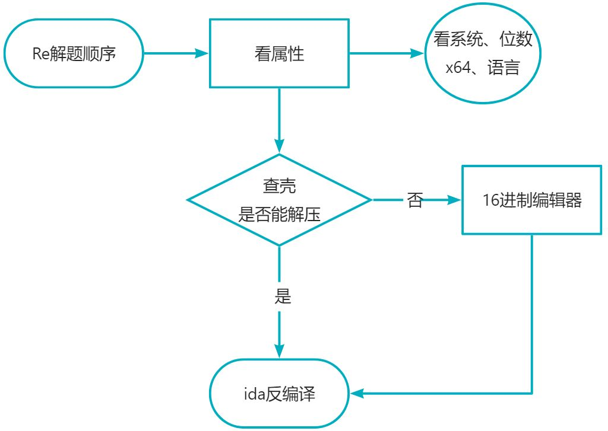

### ida用法
#### 常用快捷键

##### F系列【主要是调试状态的处理】

+ F2 添加/删除断点
+ F4 运行到光标所在位置
+ F5 反汇编
+ F7 单步步入
+ F8 单步跳过
+ F9 持续运行直到输入/断点/结束

##### shift系列【主要是调出对应的页面】
+ shift+F1 Local types
+ shift+F2 execute scripts【常用】
+ shift+F3 Functions
+ shift+F4 Names
+ shift+F5 Signatures
+ shift+F7 Segments
+ shift+F8 Segments registers
+ shift+F9 Structures
+ shift+F10 Enumerations
+ shift+F11 Type libraries
+ shift+F12 Strings【常用】
+ Shift+E 导出数据【常用】

##### 单字符系列【基本是数据处理转换相关】
【这些都比较常用】
+ G 按地址查找
+ D 将字符串等元素转为数据
+ N 重命名（函数名、变量名等）
+ Y 修改变量类型等（比如int改char等等）
+ H decimal 数据的进制快速转换
+ A 将数据转变为字符串类型
+ C code（将数据转变为汇编代码，分为自动和强制执行）
+ U undefined（将字符串转变为原始数据）
+ X 交叉引用（反汇编页面）
+ P 选中位置识别为函数

##### Ctrl、Alt系列
+ Ctrl+F 搜索【常用】
+ Ctrl+X 交叉引用（汇编页面）【常用】
+ Alt+T 查找Text
+ Ctrl+T 查找下一个text
+ Alt+C Next Code
+ Ctrl+D Next Data
+ Ctrl+Z 撤销
+ Ctrl+S 跳转到任意段
+ Ctrl+Shift+Z 恢复
+ Alt+K 修改堆栈值

##### else
+ / 添加注释 or 右键选择edit comment【常用】
+ \ hide cast，隐藏/显示一些变量类型注解
+ Ins 添加区块注释
+ 快捷键“Tab”/“F5”主要用于在汇编指令和伪代码之间进行切换，并将光标移动到对应的代码处
+ “空格键”的主要功能是用于在反汇编窗口的文本视图和图形视图之间进行切换

#### 动态调试
##### F系列【主要是调试状态的处理】
+ F2 添加/删除断点
+ F4 运行到光标所在位置
+ F5 反汇编
+ F7 单步步入
+ F8 单步跳过
+ F9 持续运行直到输入/断点/结束


#### IDA 代码修复 & 数组识别
+ 在伪代码区修改反编译语法为熟悉的语法，如：“scanf”"printf”；
+ 遇到“=”后面的**数字**可以试图转换为**字符串**，更易理解；
+ 重定义函数类型：右键“Set item type...Y”（快捷键为Y），重新定义类型
+ 两个数组连续，可能是ida将其切分错误，应该为同一个字符串，重新定义数组命名即可自动合并

### UPX脱壳

##### 命令行脱壳
```cpp
cd D:\CTF\#Tool\脱壳\upx-4.2.1-win64脱壳
upx -d 地址
pause
```

##### 手动脱壳

### Python

#### 简简单单的逻辑

```python
flag = 'xxxxxxxxxxxxxxxxxx'
list = [47, 138, 127, 57, 117, 188, 51, 143, 17, 84, 42, 135, 76, 105, 28, 169, 25]
result = ''
for i in range(len(list)):
    key = (list[i]>>4)+((list[i] & 0xf)<<4)
    result += str(hex(ord(flag[i])^key))[2:].zfill(2)
print(result)
# result=bcfba4d0038d48bd4b00f82796d393dfec
```

代码解释：

`list`中的`i`个字符经过`key`的加密，与`flag`进行异或计算，用`hex`转成16进制，使用`[2:]`进行截取，再用`str`转化成字符，并用`zfill`补全。

```
知识补充

ord把一个字符转换为ASCII码

hex 生成的16进制字符串带0x前缀，需要使用[2:]进行截取  
zfill 是将字符串填充至目标位数，位数不足的前面补零
```

逆向代码

```python
result = 'bcfba4d0038d48bd4b00f82796d393dfec'
flag = ''
list = [47, 138, 127, 57, 117, 188, 51, 143, 17, 84, 42, 135, 76, 105, 28, 169, 25]
for i in range(len(list)):
    key = (list[i] >> 4) + ((list[i] & 0xf) << 4)
    flag += chr(int(result[2 * i:2 * i + 2], 16) ^ key)
print(flag)

# NSSCTF{EZEZ_RERE}
```

代码解释：

将`result`将两个两个的取出，转换成16进制，与`key`异或，再转成字符,即可。

### Base64

常见的思路：

+ base64的格式主要以`==`结尾
+ 特殊加密会使用**自定义映射字符**（标准为`ABCDEFGHIJKLMNOPQRSTUVWXYZabcdefghijklmnopqrstuvwxyz0123456789+/`）
+ 通过自定义映射字符解密即可[在线自定义base64编解码](http://web.chacuo.net/netbasex)。

### 安卓逆向

#### 环境配置

[安卓逆向基础流程（纯小白教程）-CSDN博客](https://blog.csdn.net/liKeQing1027520/article/details/138134138) 

#### 逆向流程

+ 丢进jadx和安卓模拟器

##### Session1: Activity

一个Activity就是一个页面呢，每一次页面切换，就是Activity 的切换。问题来了，我们怎么才能知道一个软件有哪些Activity呢？

答案是 查找AndroidManifest.xml文件里的Activity标签

##### Session2: Src

在 apk运行时可显示的大部分图片，字符串，都会被赋予一个int值，然后由一个R类同一管理，而具体的数据则是在res里的drawable和value里，value里的 string.xml(resources.arsc/res/value/) 有你想要的字符串，你能找到这段flag吗喵

##### Session3: Layout

layout就是布局的意思呢，/res/layout里的带Activity字样的xml文件通常是用来描述一个Activity的大体布局，你能找到布局里藏起来的flag吗喵？

##### Session4: Raw Res

你知道吗？？apk中不用编译的资源（一下其他类型的文件)通常放在/assets目录和/res/raw目录下呢，你能找到第四段flag吗喵？（悄悄告诉你，这个比赛很容易考到呢)

##### Session5 : Native code

导出ezandroidstudy.so文件，丢进ida

### Debug

丢进观察代码

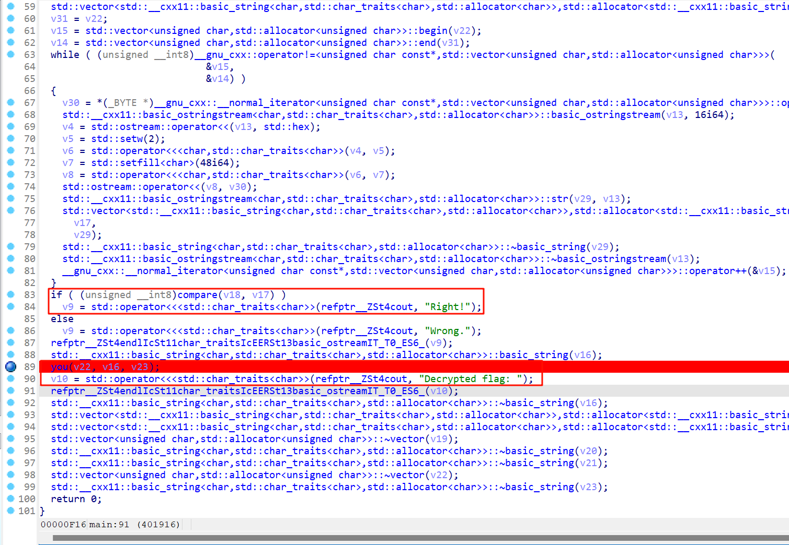

反汇编得到的是c++代码，main函数里找一找，有个you()函数被调用了

这个you()函数就是关键加密，它的逻辑是：不管你输入的字符串是正确的还是错误的flag，它都会将正确的flag解密出来然后临时开辟一块内存来存放(说白了就是强迫你动态调试才能看到flag)

所以你在you()函数里面找一找那个用来存放flag的变量，在flag被解密后打断点，去看它的值，就拿到flag了

其实解密flag的过程就是那个for循环

循环一结束，flag的内存就被回收了，所以看不到

就是用这种机制来强迫你动调的

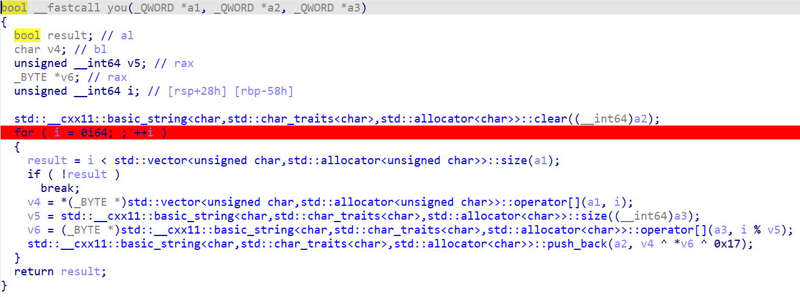

#### Local Windows debugger

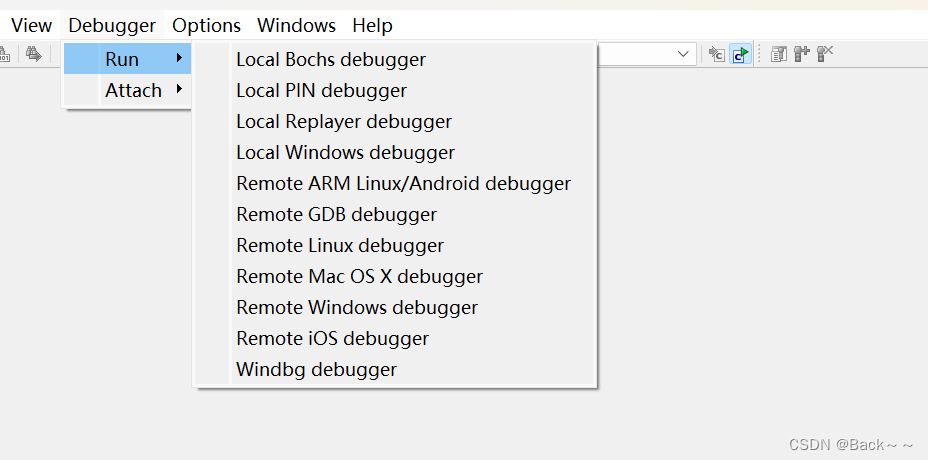 

**本地调试启动**方法
载入IDA后，程序实际上在对程序内置的一个字符串进行base64解码

考虑到运行过程中会直接生成所需的明文，所以调试直接抓取最终的嗯嗯解码结果会更加便捷

选择后端，选择调试器后端为Local Windows debugger“ ，即可使用IDA内置的调试器
开始调试，IDA调试OD和x64DBG的快捷键基本一致，要启动程序只需要按F9即可，单击相应工具栏的绿色的三角形可以。在启动调试前，IDA会弹出一个确认对话框，单击”Yes“按钮，即可调试
被调试文件默认的额路径为输入文件的路径，若目标文件不存在，或其他原因加载失败，IDA均会弹出警告对话框，确认后会进入Debug application setup设置的对话框

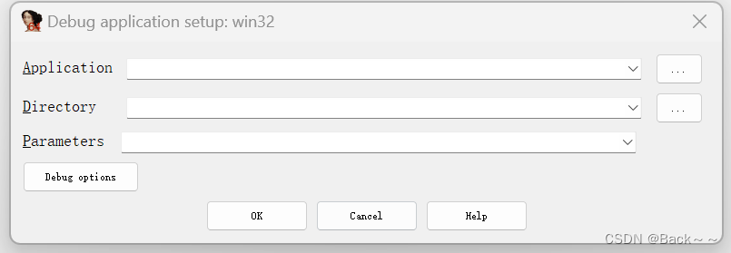 

设置后单击”OK“按钮，IDA重新尝试启动程序

#### 设置断点

#### 查看变量

在中断后，选择`Debugger->Debugger windows->Locals`菜单命令，打开查看局部变量的窗口

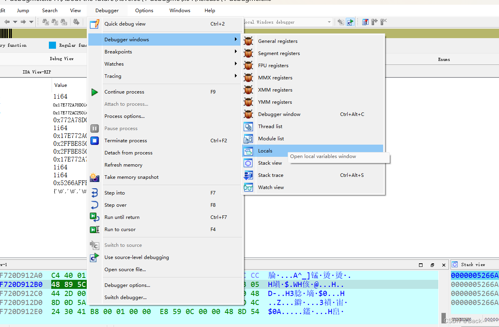 

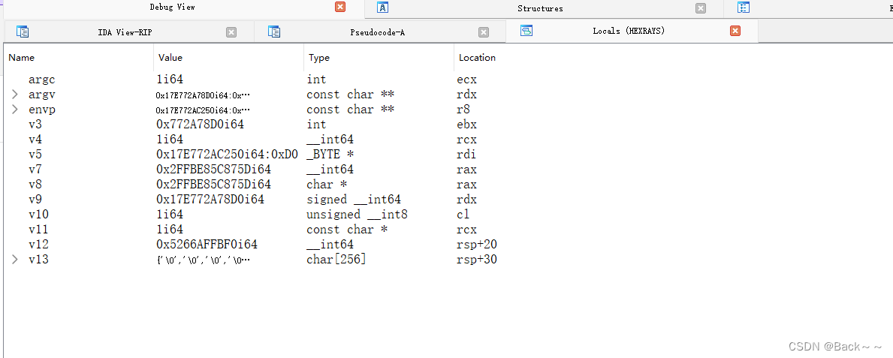 

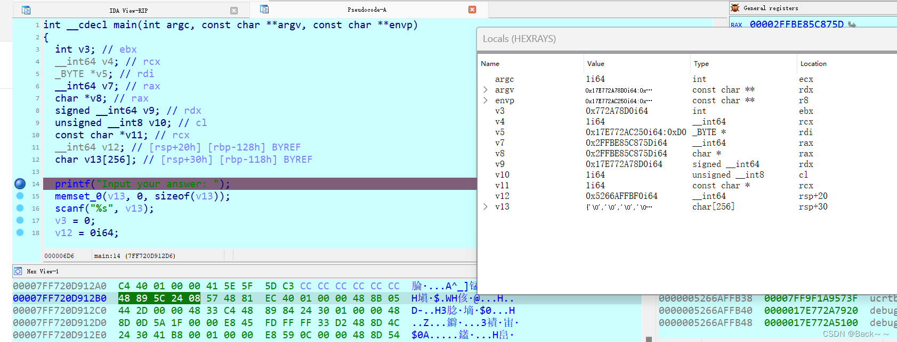 

默认情况下，locals窗口与伪代码窗口一起显示

 

单步执行至scanf，会发现程序进入运行状态，此时等待用户输入，随意输入一些内容后回车，程序再次中断

此时Loacal窗口中的v13变量显示刚才输入的值

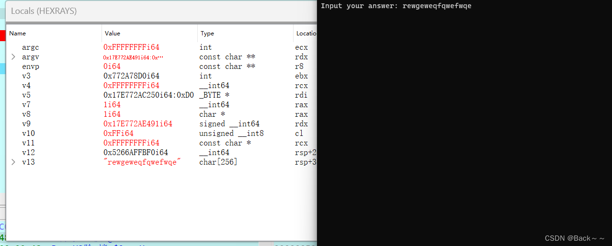 

红色代表这些变量的值被修改过

继续执行程序至base64_decode后，可以看见v5已经被修改成另有一个值

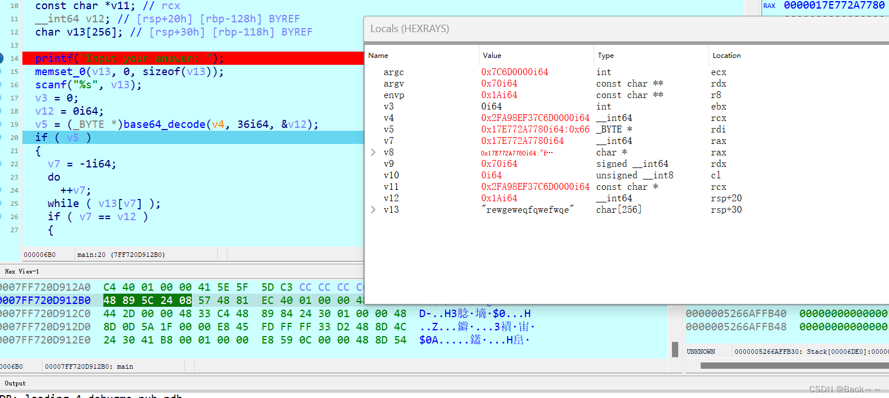 

但实际上v5为一个字符串，存放着正确的输入

#### 如何获取v5的内容

1. **在Locals窗口的Location栏中可以看到v5的位置为RDI，在寄存器窗口可以看到RDI的值，单击其值右侧的按钮，可以可看见flag**
2. **修改v5的了类型，从_BYTE修改为char，此时HexRays会认为v5是一个字符串，从而将其在Locals中显示出来，具体操作：在伪代码窗口中按Y键，修改v5类型为char*并确认，然后在Loacls窗口中右键单击Refresh刷新**

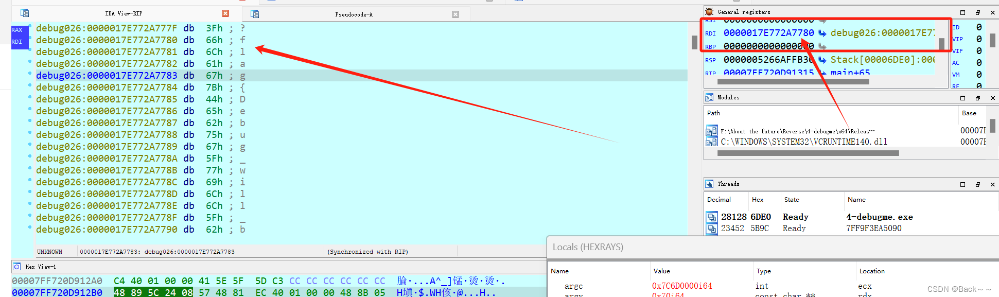 

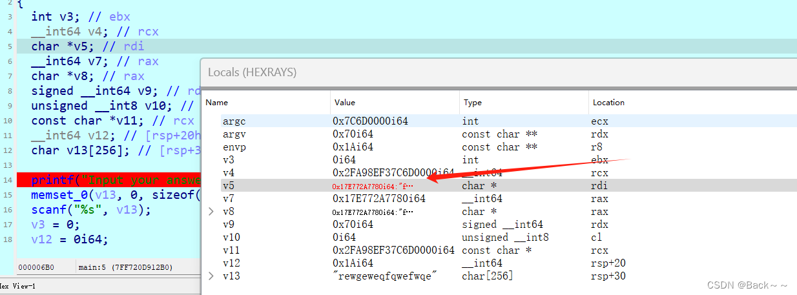 

至此，我们成功的利用调试找到了内存中的flag

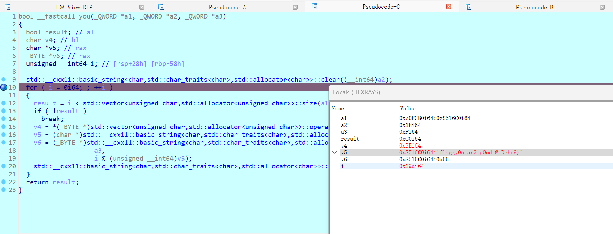

