> 文章转载自[ida在kali-linux虚拟机上进行远程调试（提供可能的解决无法连接的思路）内含本机与linux虚拟机无法互相ping通的解决方法（见标题四.（七））_ida远程调试linux-CSDN博客](https://blog.csdn.net/liKeQing1027520/article/details/137482798)


>  本篇记录本蒟蒻逆向博主在ida进行远程调试踩的坑，一是方便自己以后不再踩，二则便于后人少走弯路 
 本篇的学习目的是要**借助linux虚拟机提供一个linux环境，实现ida远程调试程序**，因为大多数人想必和博主一样只有windows一个主系统，这种情况下逆向分析过程中如果遇到elf文件，且必须通过动态调试才能解决（或者说借助动调可以大大降低逆向难度），如果不能进行linux远程调试，那将只能**望题兴叹**！ 


## 一，自编译c语言文件生成elf程序

ELF的全称是Executable and Linkable Format，即linux系统下的可执行程序，我们远程调的当然是elf程序，windows下的32和64位程序都没必要~~脱这个裤子放屁~~，明明能直接本地动调干嘛还绕一圈虚拟机（bushi）

而为了确保本篇能够将问题说清楚明白，因此在【**一**】这里先统一自编译出一个简单的elf程序，以便用于测试远程调试


### （一）创建c语言文件

在kali-linux虚拟机中创建一个c语言文件（建议创建在桌面上）并编写如下代码

可以使用touch命令创建文件，vim编辑文件保存，也可以直接右键创建文件，双击进入文件编辑

```
#include<stdio.h>
#include<string.h>
int main(){
        char arr[50];
        scanf("%s", arr);
        if(!strcmp(arr, "flag{you_get_it!}")){
                puts("Good!");
        }
        else{
                puts("Bad...");
        }
        return 0;
}

```

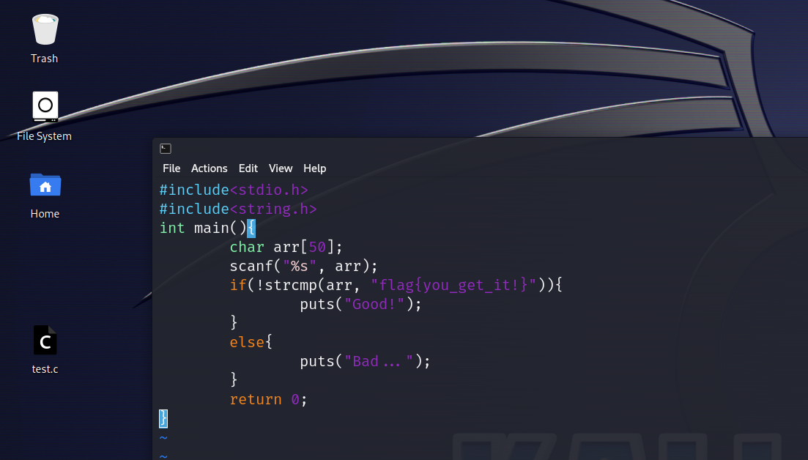


###  （二）编译c语言文件生成elf程序

使用【**gcc -o 生成程序名 待编译文件名**】命令编译c语言文件，将在同目录下产生elf程序

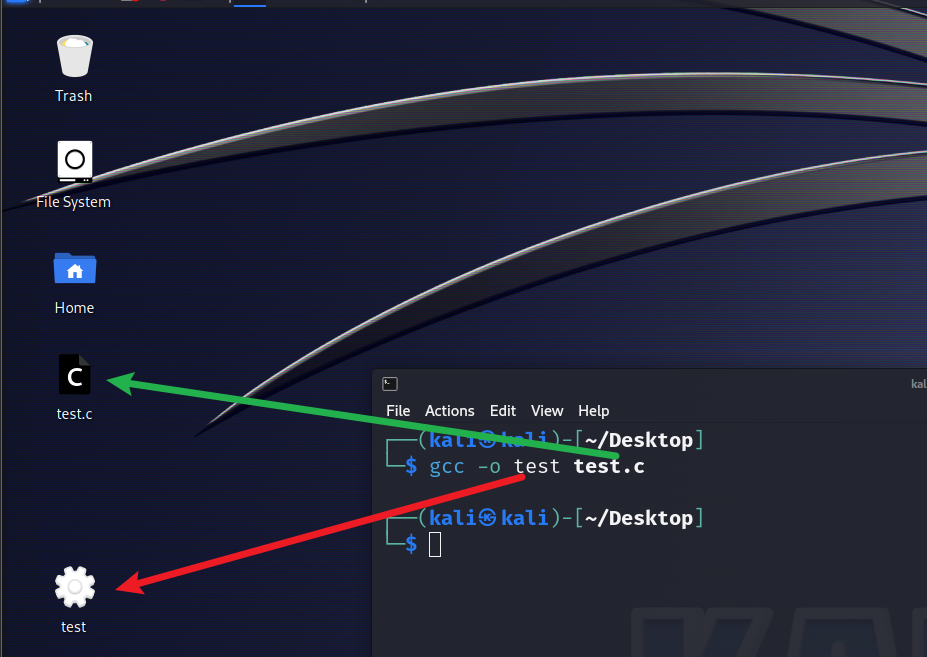


## 二，复制ida的linux_server64程序到kali-linux虚拟机中并启动，建立远程调试桥梁

在本机的ida安装目录中找到【**dbgsrv**】文件夹，将其中的【**linux_server64**】（当然你的虚拟机如果是32位的<-很少见的情况吧，请使用【**linux_server**】）程序复制到kali-linux虚拟机中（直接拖动复制）

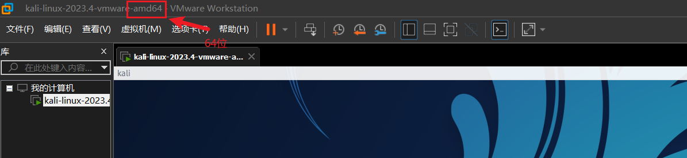

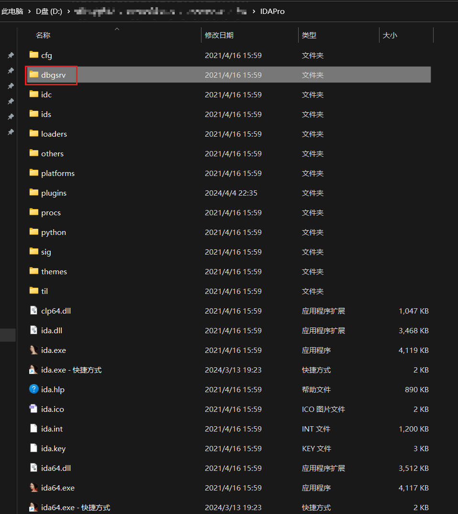

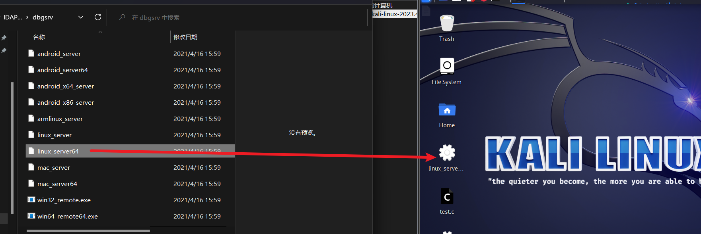

【**./linux_server64**】命令运行该程序，默认监听端口23946，可以用-p参数修改端口

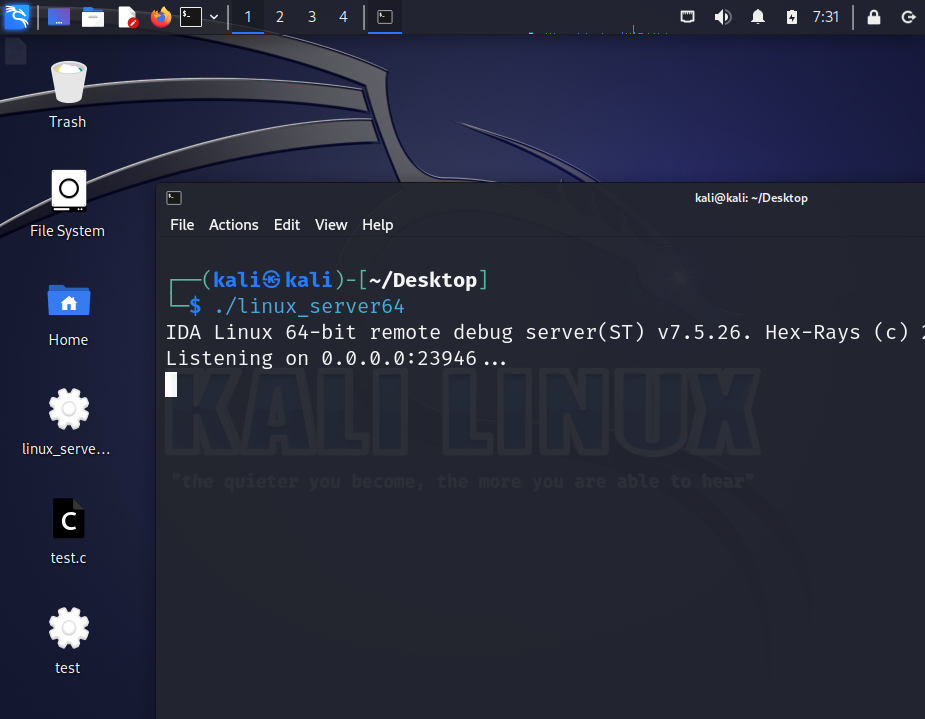


##  三，打开本地ida，连接kali-linux虚拟机，进行远程调试

建立一个新且空的调试项目，【**Debugger**】->【**Run**】->【**Remote Linux debugger**】

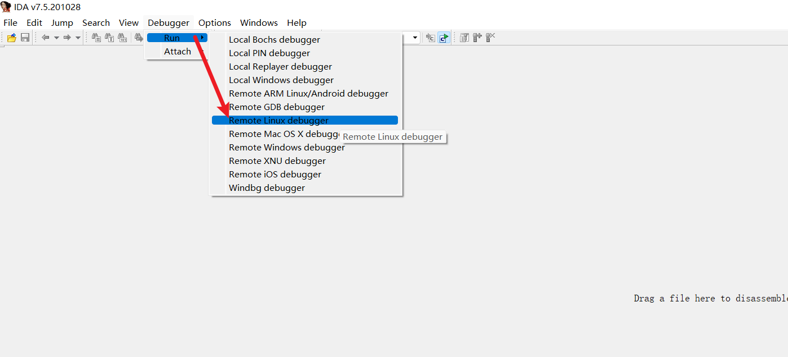

在【**调试选项窗口**】（如果ida没有自动弹出这个窗口，在Debugger里找）中按如下图提示输入对应的内容，如果没有提示则默认不输入

（注，本博主观察到似乎不同版本的ida在此【**调试选项窗口**】的内容多多少少存在差异从而导致硬搬的小白可能无法连接的原因第一步就栽在这里<-骂的就是蒟蒻博主自己/(ㄒoㄒ)/~~

所以这一步请仔细观察自己的调试选项窗口填写参数的参数名，主要是Directory这一栏要填的是调试文件的**父**目录即上一级目录，博主的ida要填的只有这两个路径，但博主在查资料时看见其它很多ida要填三个路径，所以根据自己ida的差异填写对应参数就好了，不然会导致后续连接失败的）

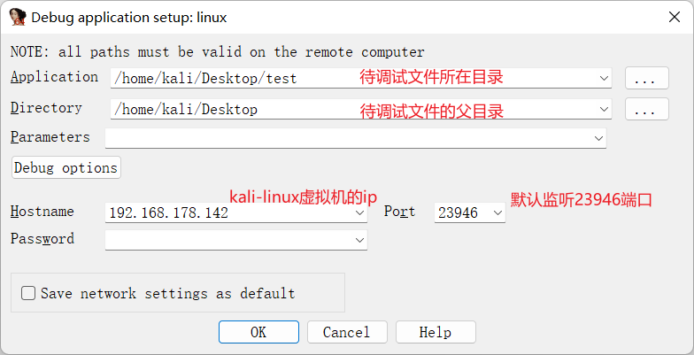


填完调试选项后最后点OK就可以成功连接了

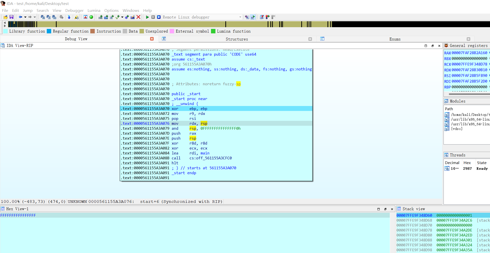

【F5】反编译后找到main函数，虽然代码有些变化，但很显然就是我们自己写的那个c语言程序

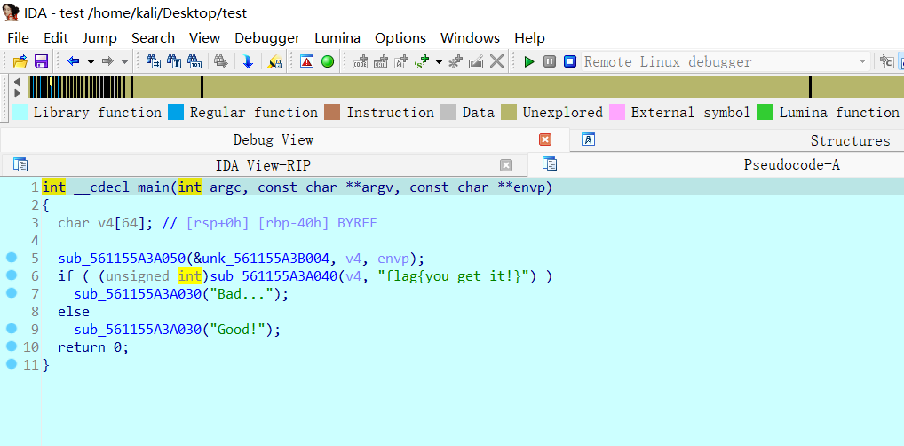


## 四，提供可能的解决无法连接的思路

蒟蒻博主也是花了好几天的时间来学习远程调试，被下面这个框折磨得当时差点放弃逆向/(ㄒoㄒ)/~~

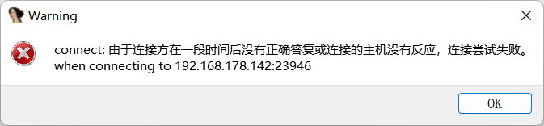

 提供几个可能的连接失败的思路供参考解决


>  <h3>（一）待调试文件所在目录输入错误</h3> 
>  <h3>（二）待调试文件的父目录错输成待调试文件目录</h3> 
>   这两个问题上面其实已经提过了 
>
>  


>   <h3>（三）虚拟机的ip地址输入错误</h3> 
>   检查【**调试选项窗口**】的Hostname一栏填写的ip是否与虚拟机的ip一致，在虚拟机中使用【**ifconfig**】命令查询你的ip 


>   <h3>（四）检查虚拟机是否启动远程调试服务器</h3> 
>   <h3>（五）检查【**调试选项窗口**】的Port一栏填写的端口是否与虚拟机中监听的端口一致</h3> 
>   <h3>（六）32位虚拟机系统应该要启动linux_server而非linux_server64</h3> 
>   
> 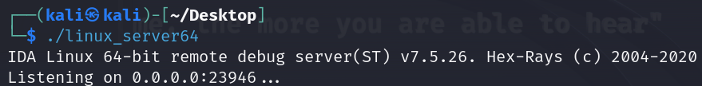

>  <h3>（七）检查主机和虚拟机是否能互相ping通</h3> 
>  如果通过以上方法都无法解决，你可能和本蒟蒻博主遇到的是这个相同的问题 
>  【**ping**】命令是用来检测两台机器（系统）是否联网或者物理联通的，如果主机和虚拟机无法互相ping通，调试服务器的代理功能自然无法发挥 
>  （自行测试：打开cmd窗口ping虚拟机的ip；虚拟机中ping本机的ip<-本机ip在cmd窗口中使用【**ipconfig**】查看） 
>  如果确实无法联通，请按照如下做法—— 
>
>   <h4>1.重置虚拟网络配置</h4> 
>   【**编辑**】->【**虚拟网络编辑器**】->【**更改设置**】->【**还原默认配置**】，然后**重启虚拟机** 
>  
> 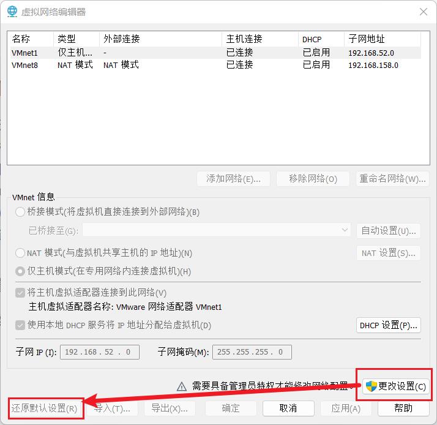
>
>   <h4>2.设置网络连接模式</h4> 
>   【**虚拟机**】->【**设置**】->【**NAT模式**】 
>  
> 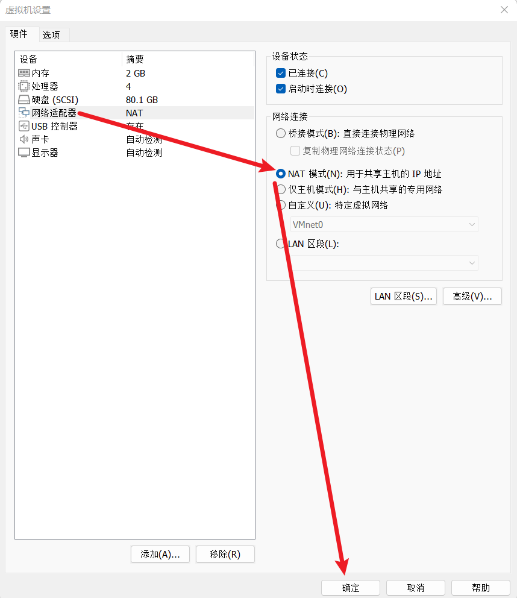
>
>   <h4>3.设置静态ip</h4> 
>   使用命令【**cd/etc/network**】->使用命令【ls】（无关紧要，查看目录而已，可省略）->使用命令【**sudo vim interfaces**】，接下来要编辑这个文件，**sudo**用于声明管理权限！ 
>   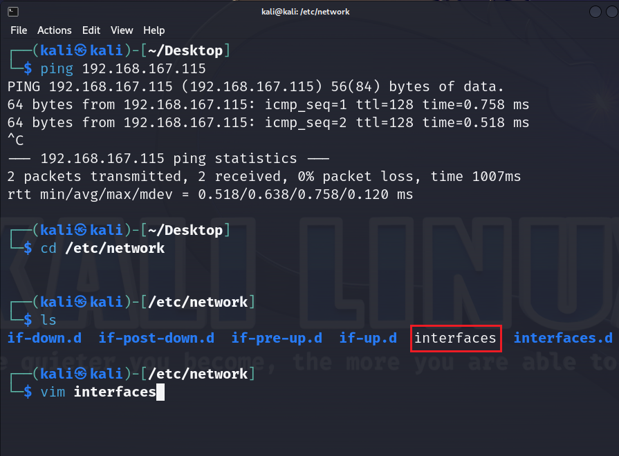
>   **按i键**进入插入内容模式，将如下内容**修改成符合自己的情况后**复制到文件中，要改的其实只有倒数第一行和倒数第三行，因为虚拟机分配的子网ip不同，必须要设置成符合自己的 
>   例如，我这里分配的子网ip是【**192.168.158.0**】，因此我设置了address为【**192.168.158.142**】，gateway为【**192.168.158.2**】，这里需要**保证ip的前3部分一致**（都是计网基础了，蒟蒻博主当初也没好好学计网，早晚得还的/(ㄒoㄒ)/~~） 
>
>  ```
>  auto lo
>  iface lo inet loopback
>  auto eth0
>  iface eth0 inet static
>  address 192.168.158.142
>  netmask 255.255.255.0
>  gateway 192.168.158.2
>  ```
>
>   怎么查看自己分配的子网ip？【**编辑**】->【**虚拟网络编辑器**】 
>   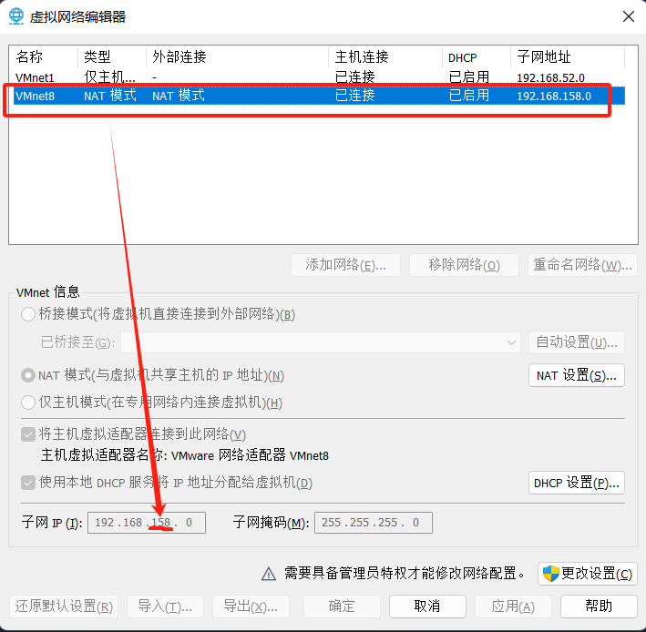 
>
>   写入文件后，【**esc**】退出插入内容模式，按冒号键【**:**】->输入wq退出并保存 
>   最后使用命令【**systemctl restart networking**】重启网络，完成配置 
>   （自行测试：打开cmd窗口ping虚拟机的ip；虚拟机中ping本机的ip<-本机ip在cmd窗口中使用【**ipconfig**】查看，测试成功后再次尝试ida远程调试连接） 


