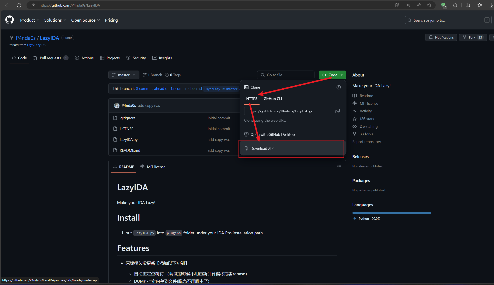
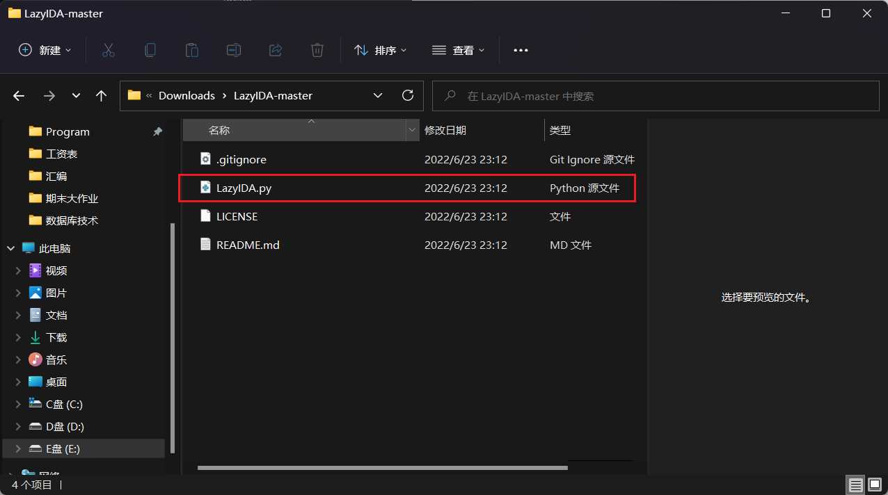
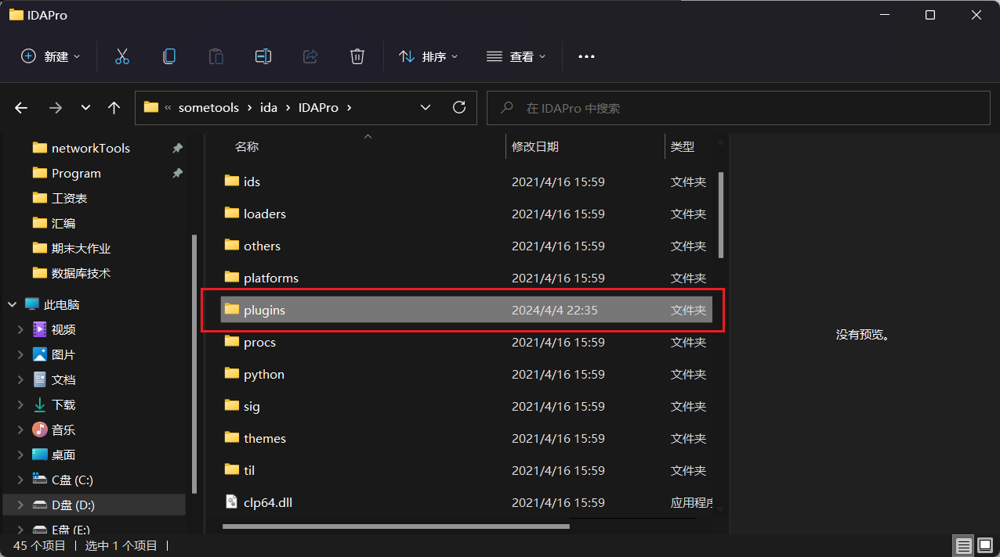
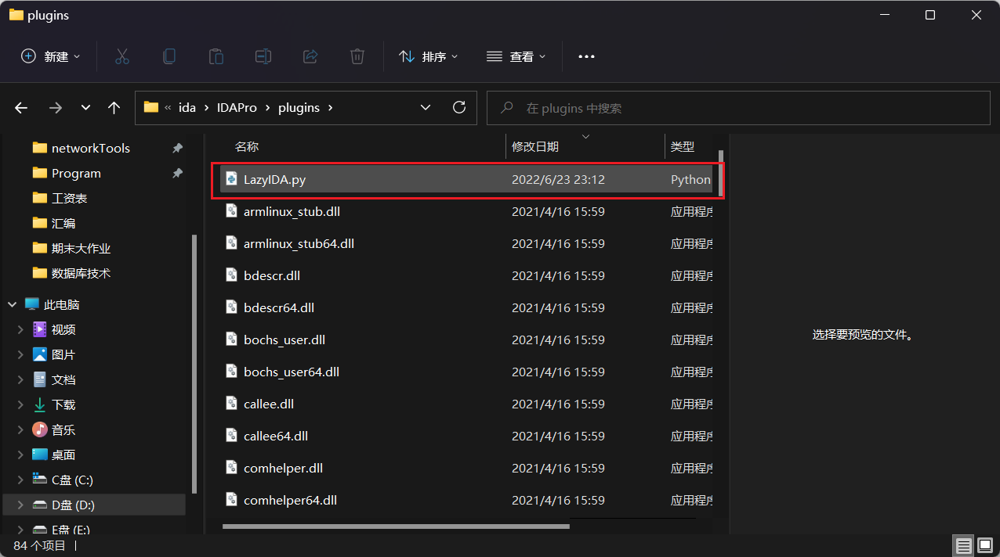
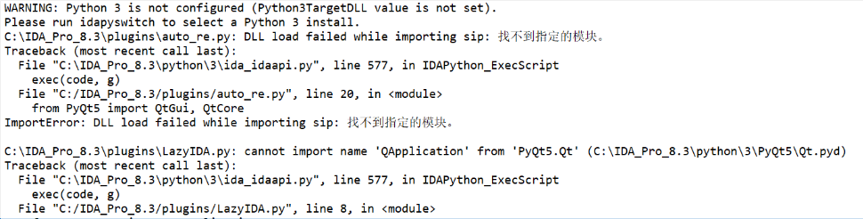
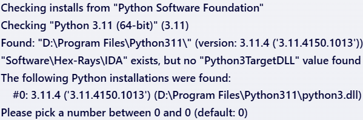

## 一，下载插件

### 插件链接

在该GitHub仓库下载插件->[GitHub - P4nda0s/LazyIDA: Make your IDA Lazy!](https://github.com/P4nda0s/LazyIDA)

如果你有访问GitHub速度极慢的问题，可以参考本篇->[如何快速访问GitHub等国外资源网站？白嫖资源必备！_微软商店 github-CSDN博客](https://blog.csdn.net/liKeQing1027520/article/details/135915512)

来到仓库后以压缩包形式完成下载




## 二，解压获取插件

对下载好的压缩包进行解压，打开文件夹，找到下图所示的python文件




## 三，移动插件到ida的plugins目录下

将第二步获取到的python文件移动（复制/剪切->粘贴）到ida的plugins目录中，





## 四，重启ida后即可使用

## P.S.重启ida后发现插件并未正常运行

检查发现报错信息



查询ai后采取以下解决方案：

1. **配置 Python 3**：
   - 您的 IDA Pro 警告说 Python 3 没有配置好（Python3TargetDLL 值未设置）。您需要使用 `idapyswitch` 工具来选择并配置一个已安装的 Python 3 版本。这个工具通常随 IDA Pro 一起提供。

   - 打开命令行或终端，导航到 IDA Pro 的安装目录，并运行 `idapyswitch`。例如：

     ```bash
     cd C:\IDA_Pro_8.3
     .\idapyswitch.exe -3 [path_to_your_python3_installation]
     ```

     其中 `[path_to_your_python3_installation]` 是您系统中 Python 3 的安装路径。

   - 配置完后双击idapyswitch.exe文件，显示如下

     

   - 根据您提供的输出信息，`idapyswitch` 工具已经找到了安装在 `D:\Program Files\Python311\` 的 Python 3.11.4 版本，但是它在注册表的 `Software\Hex-Rays\IDA` 项下没有找到 `Python3TargetDLL` 的值。这意味着 IDA Pro 还没有配置为使用这个 Python 安装。

     输出还提示您选择一个 Python 安装（在 0 和 0 之间选择一个数字，默认是 0），这实际上是一个有点混淆的表述，因为只有一个选项（编号为 0）。不过，这通常意味着您可以**按回车键选择默认选项**（即编号 0 的 Python 安装）。

2. **检查 PyQt5 安装**：
   - 错误信息显示 `PyQt5` 的 DLL 加载失败。这可能是因为 PyQt5 没有正确安装，或者安装的版本与您的系统或 Python 版本不兼容。
   - 尝试重新安装 PyQt5。您可以使用 pip（确保您使用的是 Python 3 的 pip）来安装：
     ```bash
     pip install PyQt5
     ```
   - 如果已经安装，尝试更新到最新版本：
     ```bash
     pip install --upgrade PyQt5
     ```

3. **环境变量**：
   - Windows下使用不要忘记在环境变量加入C:\IDA_Pro_8.3\python38路径，否则加载不了python插件 

4. **IDA Pro 插件兼容性**：
   - 确保您使用的插件（如 `auto_re.py` 和 `LazyIDA.py`）与您的 IDA Pro 版本兼容。有时候，插件可能只支持特定版本的 IDA Pro 或 Python。

5. **重新启动 IDA Pro**：
   - 在进行了上述更改后，确保完全关闭 IDA Pro 并重新打开，以确保所有的配置更改都已生效。

## 备注：此处ida为特殊版本

链接：[IDA Pro 8.3 整合版 - 吾爱破解 - 52pojie.cn](https://www.52pojie.cn/thread-1861590-1-1.html) 