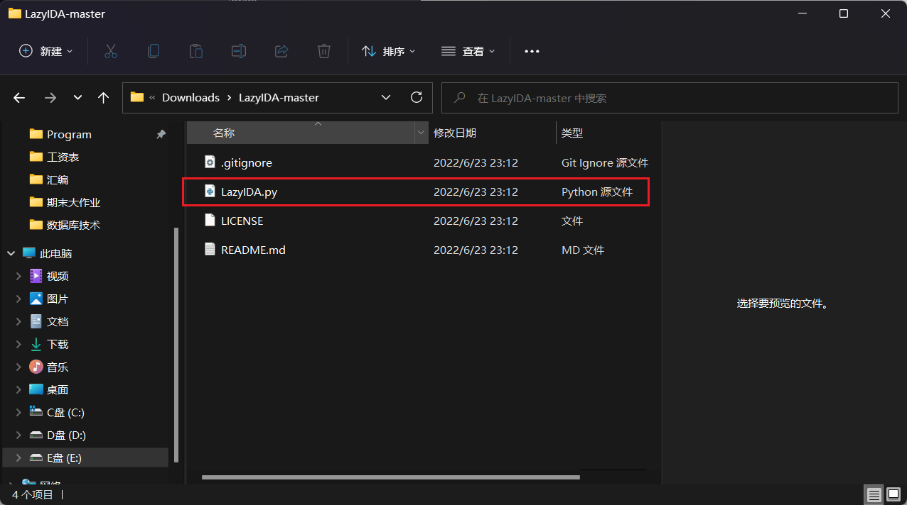

> 文章转载自[ida数据提取技巧-利用LazyIDA插件实现一键提取无法识别的字符串-CSDN博客](https://blog.csdn.net/liKeQing1027520/article/details/137384900)

>  首先具体介绍一下这个技巧的意思，因为标题可能没有说的很明白 
>  在使用ida逆向分析的过程中，会遇到某些密文、密钥之类的字符串，而这些字符串往往不全是由正常字符组成的，其中存在一些非常规字符，而一旦ida在识别字符串的过程识别到这种字符，就会认为该字符串到此已经结束（但我们知道，字符串必须是由0来结束的），并把之后的字符当成内存中无意义的数据进行排列，例如下图所示的【**17h**】字符 
>  这种情况会导致我们难以提取出有效数据（手动复制、删除无关数据、统一数据形式等步骤极其浪费时间），借助插件，则可以帮助我们快速提取出有效数据 
>  

## 一，下载插件 

### 插件链接

在该GitHub仓库下载插件-&gt;

如果你有访问GitHub速度极慢的问题，可以参考本篇-&gt;

来到仓库后以压缩包形式完成下载

## 二，解压获取插件

对下载好的压缩包进行解压，打开文件夹，找到下图所示的python文件

## 三，移动插件到ida的plugins目录下

将第二步获取到的python文件移动（复制/剪切-&gt;粘贴）到ida的plugins目录中，

## 四，重启ida后即可使用

以攻防世界的xxxorrr这题为例

### 题目链接

（这是一个题目清单、需要手动筛选后找到具体题目）

在其中有一个字符串s2需要提取，使用鼠标选中要提取的内容-&gt;【**Convert**】-&gt;【**Convert to python list(BYTE)**】

最后在输出窗口处直接获取到需要的有效数据！比起手操快的不是一星半点，学会这个才清楚自己比ak佬的差距！

