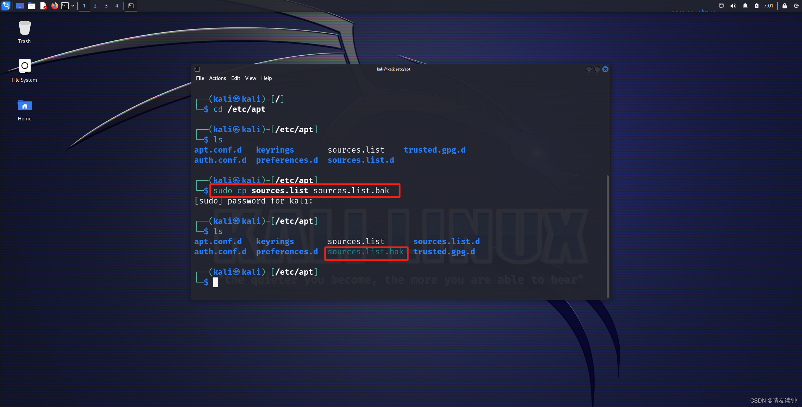

## 安装Kali

**下载kali**

kali.org进入官网后点第二个


然后点第一个


**解压kali**

下载后获得.7z压缩包，建议移动到合适自己电脑的位置进行解压，我喜欢放在D盘


**启动kali**

双击进入解压出的文件夹，将唯一一个.vmx文件用vmware打开（没装的自行提前装一下） 

 （其实可以直接双击打开的）


然后点击【开启此虚拟机】，一直等到如下页面，输入默认的账号密码，都是**kali**


## 设置root用户

```text
sudo passwd root
```

分别输入`kali` `root` `root`即可生成超级用户：账号密码，都是**root**


## 设置中文

第一步打开命令终端  输入这行命令，密码就是前面设置的

```
sudo dpkg-reconfigure locales
```

 用**滚轮或者上下键**选择语言，使用**空格键**选中`zh_CN.UTF-8`，然后回车  选中`zh_CN.UTF-8`为默认语言，然后回车  输入reboot重启然后就是

  

这里一定要选择**保留旧的名称**，不然每次你进文件夹还有输入中文岂不是麻烦

 然后就设置好了 


## 换北外源

换国内的镜像源可以加快下载速度，下面的流程是换北外源

## 法一

来到经典桌面，右键打开菜单，左键点击【Open Terminal Here】打开终端 


 用命令->`cd /etc/apt`把目录切换到此，`ls`命令列出当前目录的文件，下一步我们要进行的操作是修改`sources.list`文件里的内容，即添加下载源，但在此之前建议先复制一份该文件，留一个备份（好习惯）


使用命令`sudo cp sources.list sources.list.bak`对目标文件进行备份（会要求输入密码，输入默认密码kali即可，密码不会显示，是透明字，不影响），用`ls`命令列出当前目录所有文件，验证是否成功复制

 使用如下命令进行换源（sudo不能漏，用来授予管理员权限）：

```
sudo sed -i "s@http://http.kali.org/kali@https://mirrors.bfsu.edu.cn/kali@g" /etc/apt/sources.list
```


`cat`命令两个文件，对比备份文件的内容，验证换源成功


## 法二

在控制台输入

```
vim /etc/apt/sources.list
```


在进入这个界面后，输入`i` 后会显示出现下图的insert，这个表示进入了插入模式可以进行修改


将旧的源插入#进行注释

```
#deb http://http.kali.org/kali kali-rolling main contrib non-free non-free-firmware
```


从下面的源内选择一个复制下来准备粘贴进去（都是优质源，选其一即可）

```
中科大Kali镜像源

deb http://mirrors.ustc.edu.cn/kali kali-rolling main non-free non-free-firmware contrib
deb-src http://mirrors.ustc.edu.cn/kali kali-rolling main non-free non-free-firmware contrib

```

```
阿里云Kali镜像源

deb http://mirrors.aliyun.com/kali kali-rolling main non-free non-free-firmware contrib
deb-src http://mirrors.aliyun.com/kali kali-rolling main non-free non-free-firmware contrib

```

```
清华大学Kali镜像源

deb http://mirrors.tuna.tsinghua.edu.cn/kali kali-rolling main contrib non-free non-free-firmware
deb-src https://mirrors.tuna.tsinghua.edu.cn/kali kali-rolling main contrib non-free non-free-firmware

```

将上面的源复制进去即可，如下


按键盘上的`ESC`键，左下角的`insert`消失说明操作正确


输入`:wq`（注意使用英文），回车后即保存配置并退出。


## 更新包

输入命令`sudo apt update`更新包，下载稍作等待（换源后下载很快），出现如下页面时完成更新。


 然后可以下载一些工具，比如dirsearch，直接输入`dirsearch`，因为根本还没装，所以会显示not found并问你是否安装，输入y即可，或者直接用命令`sudo apt install dirsearch`完成下载，`sudo apt install + 插件`这个命令是下载命令

**注意！！！网上很多教程都写了在`sudo apt update`之后用`apt-get upgrade `更新软件包，千万不要更新！！！**（不信邪作死反复重装踩了三遍坑得出的结论！）更新后会有大量的软件包更新，有些可能并不适配你这个版本或者其他原因，会导致系统出现莫名其妙的异常（我的桌面就看不见了）（大哭）

## 设置中文输入法

打开终端，这里已经改成了中文版  安装中文拼音输入法，这里的sudo是进入root模式下，因为要在root下才能安装，如果已经在root了，可以不用加sudo，这段命令后要输入密码，就是安装kali时候输入的密码

```
sudo apt-get install fcitx fcitx-pinyin
```
http
这里选择`Y`然后回车  配置输入法，把**fcitx输入法**设置为默认输入法      然后配置输入法    

如果没显示语言重新打开一遍

 重启

```
reboot
```

 

输入法默认切换是ctrl+空格，可以更改

设置成功

 

## 安装vmware tools

在终端输入
```sudo install open-vm-tools open-vm-tools-desktop```
即可，之后```sudo reboot```
但是还是有可能出现不能拖拽的情况，此时可以尝试`Ctrl C`，`Ctrl V`的形式进行虚拟机和外部机的文件交互，只不过比拖拽稍微麻烦一点点，但是效果是一样的，文字复制的话linux系统中是`ctrl+shift+c`和`ctrl+shift+v`注意这点。


